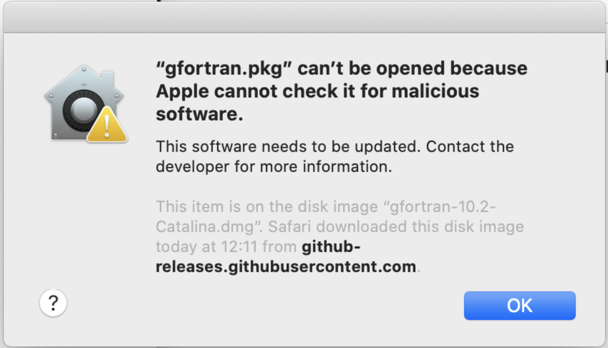

# Frequently Asked Questions

## Table of contents

- [(macOS) Cannot open ".pkg" file](#macos-cannot-open-pkg-file)

## (macOS) Cannot open ".pkg" file

**Issue**

You have double-clicked on a file with the `.pkg` extension and you see a prompt that prevents you from opening that file.
For instance:

**Solution**

Right-click the file first.
Then, in the contextual menu, click `Open`.
You may see a prompt similar to the above, but this time it will offer you two buttons, one of which allows you to proceed and run the file.
