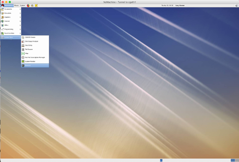

## NoMachine setup
NoMachine NX software provides a remote desktop on the HPC cluster enabling you to run graphical applications, such as Atom, Rstudio or IGV on the server. 

1. Copy the following file from `ifs/obds-training/sep20/shared/nx` to your local
computer:
* Mac users - `nomachine_5.3.12_10.dmg`
* Windows users - `nomachine_5.3.12_5.exe`

2. Install the application

3. Open NoMachine

4. Click `New` to start a new connection

5. Select `SSH` as the protocol

6. Type `localhost` for the Host and `2222` for the Port

7. Select `Use the NoMachine login`

8. Copy `cgat.key` to your local computer from `/ifs/obds-training/sep20/shared/nx` using FileZilla (see [FileZilla instructions](filezilla_instructions.pdf)). Click to use an alternative server key and supply the path to cgat.key on your local computer.

9. Select `Don't use a proxy`

10. Give a name to your connection e.g. `Tunnel to cgath1`. If you would like a link on your desktop, tick `Create a link on the desktop`

11. Type the following in your local terminal

    `ssh -L 2222:cgath1:22 <username>@cgatui.imm.ox.ac.uk`

    NB: \<username> should be replaced with your own username

12. In NoMachine, click on the connection that you just created

13. Click on `Create a new GNOME virtual Desktop`

14. Press OK to any help messages. You should now see a screen like this.

15. Well done - your connection is now setup and ready to go :)
