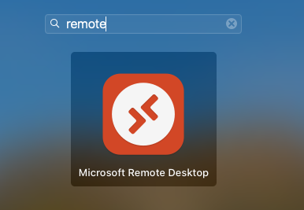
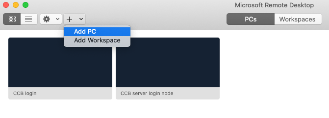
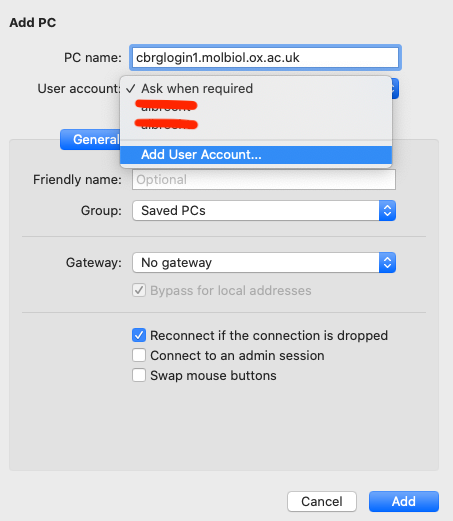
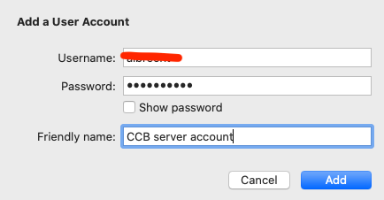
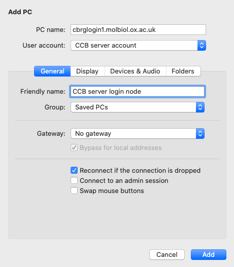
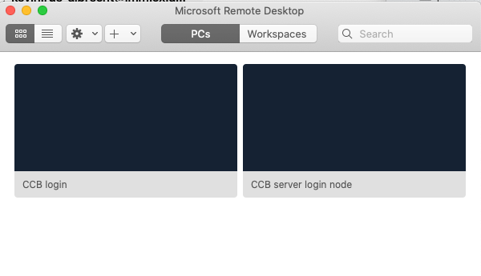

# Microsoft Remote Desktop

We will use this program to open a virtual desktop
on the remote server that we use for this course.

The remote desktop will allow us to interact more easily with programs
that use a graphical user interfaces (GUI) running directly on the server.

Get the Remote Desktop client and add a workspace following the instructions on this page: 
<https://docs.microsoft.com/en-us/windows-server/remote/remote-desktop-services/clients/remote-desktop-mac>.

Briefly, once you have installed the Microsoft Remote Desktop client:

- From the MacOS `Launchpad`, search for `Microsoft Remote Desktop`.

- Click the icon to launch the application.
- In the menu bar, click `Connections`, then `Add PC`.

- In `PC name:`, type `cbrglogin1.molbiol.ox.ac.uk`.

- In `User account:`, select `Add User Account...`.
  + In `Username`, type the account username that you were given for the CCB server.
  + In `Username`, type your account password for the CCB server.
  + In `Friendly name:`, optionally type something memorable (e.g., "CCB server OBDS account").

- In `Friendly name:`, optionally type something memorable (e.g., "CCB server login node").

- Click `Add`.

You should see a new thumbnail in the Microsoft Remote Desktop client,
alongside any other connection you might already have had.

- Double-click the new connection.

The connection should take a few seconds to be established,
at which point the client should launch a full screen window
that presents you with a remote desktop session on the remote server.

Success!