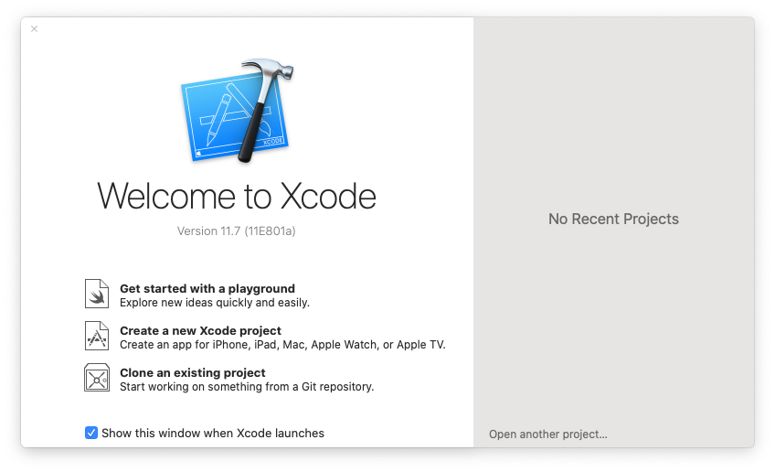

# Installing XCode (MacOS only)

Some of the software packages that we will use during the course require software development utilities that can be obtained by installing the _Command Line Tools_ for XCode.

## Note

This is only a pre-requisite for MacOS users.
If you are not a MacOS user, please ignore this.

## Instructions

- In the `App Store`, find the [Xcode Developer Tools](https://apps.apple.com/gb/app/xcode/id497799835?mt=12).
  You can click this link to go to the online Apple App Store; you can then click `Open App Store` when prompted, or click on the `View in Mac App Store` in the web page.
- In your `Applications` folder, launch `Xcode`.

You may see the following window:

</img>

- If this is the case:
    + Click `Install`
    + You may be prompted for your password. If so, enter it.

Once the installation is complete, the `Xcode` welcome screen will appear.

</img>

- You can simply close it; everything is ready.
